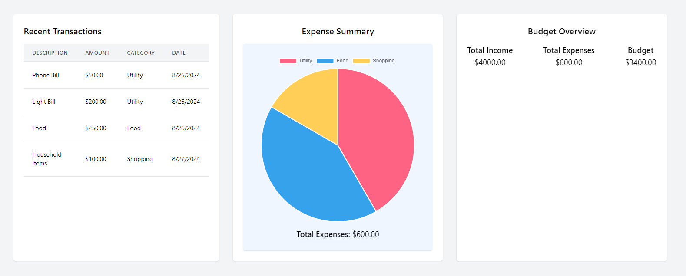

# SpendWise

A Node.js based web app for expense management with user accounts, expense graphs and goals for saving.

## Project Description

An expense tracker application is a tool designed to help users manage their personal finances by tracking their income, expenses, and overall financial health.

## Table of Contents

- [Project Description](#project-description)
- [Features](#features)
- [Installation](#installation)
- [Usage](#usage)
- [Mockup](#mockup)
- [Deployment](#deployment)
- [Collaborators](#collaborators)
- [License](#license)

## Features

- Sign up for an account by providing name, email, and password
- Log in with email
- Log out of an account

**After login, users can:**

- View all expenses/revenues
- View total amount of expenses/revenues/balance
- Add an expense and a revenue
- Delete an expense 

## Installation

1. **Clone the repository locally**
2. **Install project dependencies**
3. **Add .env file**
4. **Run npm i**

## Node Modules used

- bcrypt
- connect-session-sequelize
- dotenv
- express
- express-handlebars
- express-session
- flowbite
- pg
- pg-hstore
- sequelize

## Usage

1. **Import seed data:** npm run seed
2. **Start the app:** npm run dev

## Mockup

## Deployment

- Render Deployment:

## Collaborators

1. Zain Abid- https://github.com/zainabid333
2. Elisse Gomez- https://github.com/elissegomez24
3. Brandon Willis- https://github.com/brandon6ix
4. Melyana Lie- https://github.com/melyanalie

## License

[MIT License ](LICENSE)
